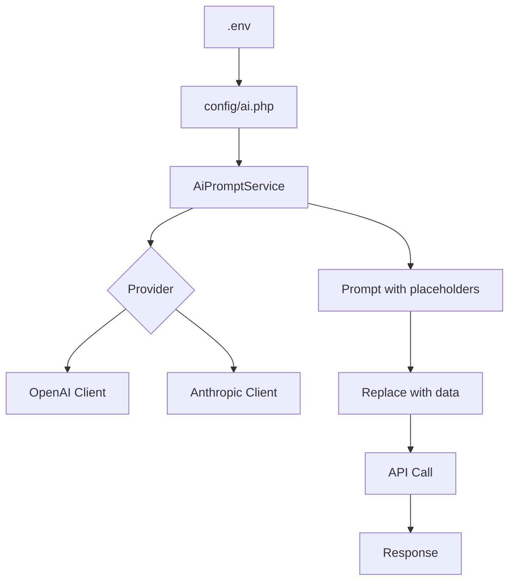

# AI Configuration Plan

## Overview
Create a new configuration file `config/ai.php` to centralize AI provider settings, prompt templates, and named configurations for various use cases (e.g., commentary generation). The configuration will support multiple providers (OpenAI, Anthropic) and allow per‑configuration version tracking.

## Configuration Schema

```php
<?php

return [
    // Global configuration version (optional)
    'config_version' => env('AI_CONFIG_VERSION', '1.0'),

    // Provider definitions
    'providers' => [
        'openai' => [
            'endpoint'    => env('OPENAI_ENDPOINT', 'https://api.openai.com/v1'),
            'api_key'     => env('OPENAI_API_KEY'),
            'model'       => env('OPENAI_DEFAULT_MODEL', 'gpt-4'),
            'temperature' => env('OPENAI_TEMPERATURE', 0.7),
            'max_tokens'  => env('OPENAI_MAX_TOKENS', 2048),
            'timeout'     => env('OPENAI_TIMEOUT', 30),
        ],
        'anthropic' => [
            'endpoint'    => env('ANTHROPIC_ENDPOINT', 'https://api.anthropic.com'),
            'api_key'     => env('ANTHROPIC_API_KEY'),
            'model'       => env('ANTHROPIC_DEFAULT_MODEL', 'claude-3-opus-20240229'),
            'temperature' => env('ANTHROPIC_TEMPERATURE', 0.7),
            'max_tokens'  => env('ANTHROPIC_MAX_TOKENS', 4096),
            'timeout'     => env('ANTHROPIC_TIMEOUT', 30),
        ],
        // Additional providers can be added later (e.g., local LLM, Azure OpenAI)
    ],

    // Named configurations for specific use cases
    'configurations' => [
        'commentary' => [
            'provider'    => env('AI_COMMENTARY_PROVIDER', 'openai'),
            // Override provider defaults if needed
            'api_key'     => env('AI_COMMENTARY_API_KEY'),
            'endpoint'    => env('AI_COMMENTARY_ENDPOINT'),
            'model'       => env('AI_COMMENTARY_MODEL'),
            'prompt'      => env('AI_COMMENTARY_PROMPT', 'Generate commentary for the following verse: {verse_text}'),
            'temperature' => env('AI_COMMENTARY_TEMPERATURE'),
            'max_tokens'  => env('AI_COMMENTARY_MAX_TOKENS'),
            'timeout'     => env('AI_COMMENTARY_TIMEOUT'),
            'version'     => env('AI_COMMENTARY_VERSION', 'v1'),
        ],
        // Example: 'summarization', 'translation', 'question_answering'
    ],
];
```

## Environment Variables

Add to `.env.example` (optional – defaults are provided):

```
# AI Configuration
AI_CONFIG_VERSION=1.0

# OpenAI (already present)
OPENAI_API_KEY=
OPENAI_DEFAULT_MODEL=gpt-4
OPENAI_TEMPERATURE=0.7
OPENAI_MAX_TOKENS=2048
OPENAI_TIMEOUT=30

# Anthropic
ANTHROPIC_API_KEY=
ANTHROPIC_DEFAULT_MODEL=claude-3-opus-20240229
ANTHROPIC_TEMPERATURE=0.7
ANTHROPIC_MAX_TOKENS=4096
ANTHROPIC_TIMEOUT=30

# Commentary configuration
AI_COMMENTARY_PROVIDER=openai
AI_COMMENTARY_API_KEY=
AI_COMMENTARY_ENDPOINT=
AI_COMMENTARY_MODEL=
AI_COMMENTARY_PROMPT="Generate commentary for the following verse: {verse_text}"
AI_COMMENTARY_TEMPERATURE=
AI_COMMENTARY_MAX_TOKENS=
AI_COMMENTARY_TIMEOUT=
AI_COMMENTARY_VERSION=v1
```

## Implementation Steps

### 1. Create Configuration File
- Write `config/ai.php` with the schema above.
- Keep the existing `config/openai.php` unchanged for compatibility with the `openai-php/laravel` package.

### 2. Update Environment Configuration
- Add the new environment variables to `.env.example` (and `.env` if needed).

### 3. Install Anthropic SDK (if required)
- Run `composer require anthropic-php/client` to support Anthropic API.
- If Anthropic is not immediately needed, the configuration can be added later.

### 4. Create Service Provider & Service Class
- Create `App\Providers\AiServiceProvider` that registers a singleton `AiPromptService`.
- Create `App\Service\Ai\AiPromptService` with methods:
  - `resolveConfiguration(string $name): array` – returns the named configuration with merged provider defaults.
  - `replacePlaceholders(array $config, array $data): string` – replaces `{placeholder}` tokens in the prompt.
  - `client(string $provider): object` – returns an authenticated SDK client (OpenAI, Anthropic, etc.).
- The service should use the configuration values to instantiate the appropriate API client.

### 5. Integrate with Existing Code
- Ensure the existing embedding service (which uses `OpenAI::embeddings()`) continues to work unchanged.
- For new AI features (e.g., commentary generation), inject `AiPromptService` and call it with the configuration name.

### 6. Testing
- Write feature tests for `AiPromptService`:
  - Test that configuration is loaded correctly.
  - Test placeholder substitution.
  - Test client instantiation (mock the API calls).
- Update `phpunit.xml` if needed.
- Run the test suite to ensure no regressions.

### 7. Documentation
- Update `README.md` or create an internal `docs/ai-configuration.md` describing how to add new providers and named configurations.

## Architecture Diagram



## Dependencies
- **OpenAI**: Already included via `openai-php/laravel`.
- **Anthropic**: Requires `anthropic-php/client` (new).
- **Laravel**: No additional dependencies.

## Backward Compatibility
- The existing `config/openai.php` remains untouched; embedding services will continue to use it.
- New AI features should use the new `config/ai.php` and `AiPromptService`.

## Next Steps
1. Review and approve this plan.
2. Switch to **Code Mode** to implement the configuration file and service.
3. After implementation, run tests and verify functionality.