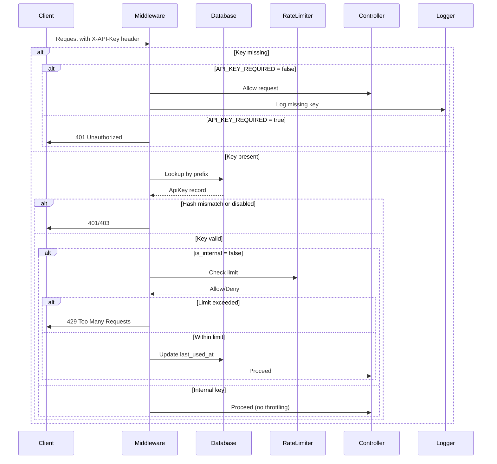

# API Keys Implementation Plan

## Objective
Introduce API keys to identify and throttle external API clients, reduce erroneous requests, and improve performance. Editors can manage keys, with a grace period before enforcement.

## Requirements
- Simple UUID-like keys, revocable via disable/enable.
- Keys provided via `X-API-Key` header only.
- Internal keys (no throttling) vs external keys (with throttling).
- Logging of API requests, especially errors.
- Editors can create, view, disable, and delete keys via UI.
- Grace period controlled by environment variable `API_KEY_REQUIRED` (false = grace period, true = enforcement).
- Keep existing IP‑based throttling as fallback.

## Database Schema

### Table `api_keys`

| Column | Type | Description |
|--------|------|-------------|
| `id` | bigint unsigned | Primary key |
| `name` | varchar(255) | Human‑readable identifier |
| `key_hash` | varchar(255) | Hashed API key (bcrypt) |
| `key_prefix` | char(8) | First 8 chars of raw key for quick lookup |
| `is_internal` | boolean | If true, no throttling applies |
| `throttle_rate` | integer nullable | Requests per minute (null = no limit) |
| `enabled` | boolean | Whether the key is active |
| `created_by_anonymous_id` | bigint unsigned nullable | Foreign key to `anonymous_ids.id` (editor who created) |
| `description` | text nullable | Optional notes |
| `last_used_at` | timestamp nullable | Last successful use |
| `usage_count` | integer default 0 | Total successful uses (optional) |
| `created_at` | timestamp | |
| `updated_at` | timestamp | |

**Indexes:**
- `key_prefix` (unique? no, but index for lookup)
- `created_by_anonymous_id`
- `enabled`

**Relations:**
- `ApiKey` belongs to `AnonymousId` (as `createdBy`)

## Middleware `VerifyApiKey`

### Responsibilities
1. Extract key from `X-API-Key` header (no query parameter fallback).
2. If key missing and `API_KEY_REQUIRED=false` → allow request, log missing key.
3. If key missing and `API_KEY_REQUIRED=true` → abort with `401 Unauthorized`.
4. If key present:
   - Look up by prefix (`substr($key, 0, 8)`) to find candidate.
   - Verify hash with `Hash::check()`.
   - If invalid → `401`.
   - If key disabled → `403 Forbidden`.
   - If key is external (`is_internal = false`) → apply rate limiting based on `throttle_rate` (default: config value).
   - Update `last_used_at` and increment `usage_count`.
5. Attach the `ApiKey` model to the request (`$request->apiKey`) for logging/controller use.

### Registration
- Add middleware alias in `bootstrap/app.php`.
- Apply to API route group (via `RouteServiceProvider` or route group).

## Configuration

### Environment Variables
```
API_KEY_REQUIRED=false           # Set to true to enforce keys (end grace period)
API_KEY_DEFAULT_THROTTLE=60      # Requests per minute for external keys (when null)
```

### Config File `config/api.php`
- Consolidate settings with defaults.

## Editor UI

### Routes (under `editor/` prefix)
- `GET  /editor/api‑keys` – list all keys (with filter by creator).
- `GET  /editor/api‑keys/create` – form to create new key.
- `POST /editor/api‑keys` – store new key (generate UUID, hash, store).
- `GET  /editor/api‑keys/{id}/edit` – edit key (name, throttle rate, enabled).
- `PUT  /editor/api‑keys/{id}` – update key.
- `DELETE /editor/api‑keys/{id}` – delete key.

### Views
- Reuse existing editor layout (`resources/views/editor/`).
- Simple table with key prefix, name, creator, last used, status, actions.

## Rate Limiting

- Use Laravel’s built‑in `RateLimiter` with a custom driver.
- Limit per external API key: `throttle:api_key,{rate}`.
- Fallback to IP‑based throttling (already present on some routes).

### Implementation Steps
1. Define a rate limiter in `AppServiceProvider`:
   ```php
   RateLimiter::for('api_key', function (Request $request) {
       return Limit::perMinute($request->apiKey->throttle_rate ?? config('api.default_throttle'));
   });
   ```
2. Apply `throttle:api_key` middleware after key verification.

## Logging

- Log all API requests with key ID, endpoint, IP, timestamp, and response status.
- Use Laravel’s logging channel (`daily`).
- Optionally store in a dedicated `api_logs` table (future).
- Emphasize error logging: when validation fails, throttle hits, or server errors occur.

## Grace Period

- While `API_KEY_REQUIRED=false`, requests without a key are allowed but logged.
- When `API_KEY_REQUIRED=true`, reject missing/invalid keys.
- Grace period is controlled solely by this environment variable (no duplicate mechanisms).

## Testing

### Unit Tests
- ApiKey model (relationships, validation).
- Middleware logic (success, missing key, invalid key, disabled key, throttling).
- Rate limiter.

### Feature Tests
- Editor UI (create, list, edit, delete).
- API endpoints with and without keys.

### Integration Tests
- Simulate grace period behavior.
- Throttling effects.

## Request Flow Diagram



## Next Steps
1. Create migration and model.
2. Implement middleware and register it.
3. Add configuration.
4. Build editor UI.
5. Integrate rate limiting.
6. Add logging.
7. Write tests.
8. Deploy with grace period enabled, then switch to enforcement after communicating with API users.

## Exclusions (per user request)
- No Bearer token format (only `X-API-Key` header).
- No API key rotation mechanism.
- No exposed usage statistics API.
