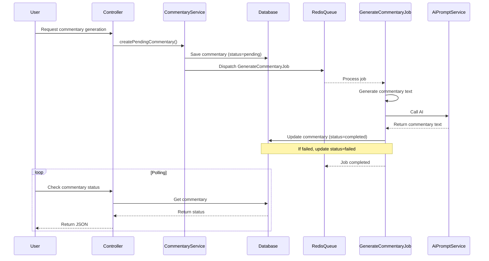

# Redis-based Queue for Asynchronous Commentary Generation

## Objective
Move the time-consuming AI commentary generation process from synchronous execution to an asynchronous Redis-based Laravel queue. This will improve user experience by preventing long request times, allow parallel processing, and provide real-time status updates.

## Current Flow Analysis

### Synchronous Generation
1. **Command Line**: `php artisan ai:generate-commentary {reference} {translation}` 
   - Parses reference, checks for existing commentaries, generates AI commentary via `CommentaryService::generateCommentaryText`, stores result.
2. **Web UI**: `CommentaryEditorController::generate()` calls the same Artisan command synchronously via `Artisan::call`.
3. **Frontend Display**: `TextDisplayController` uses `CommentaryService::findForReference` to retrieve existing commentaries and displays them.

### Database Schema
- `commentaries` table: `id`, `translation_id`, `usx_code`, `commentary_text` (text, not nullable), `metadata` (jsonb), `created_at`, `updated_at`.
- `commentary_ranges` table: `id`, `commentary_id`, `start_chapter`, `start_verse`, `end_chapter`, `end_verse`.

## Proposed Architecture

### Redis Queue Setup
- Add Redis service to `docker-compose.yml`.
- Add queue worker service to `docker-compose.yml` (runs `php artisan queue:work`).
- Configure Laravel queue driver to use Redis (`QUEUE_DRIVER=redis`).
- Update `config/database.php` Redis connection to use environment variables.

### Queue Worker Service
- **Service Definition**: A new Docker service (`queue_worker`) using the same application image as the `app` service.
- **Command**: `php artisan queue:work --sleep=3 --timeout=60 --tries=3 --graceful`
  - `--sleep=3`: seconds to wait between polling Redis when no jobs are available.
  - `--timeout=60`: maximum seconds a job may run before being considered failed (allows graceful shutdown).
  - `--tries=3`: number of retry attempts before marking job as failed.
  - `--graceful`: ensure the worker finishes the current job before shutting down when receiving SIGTERM.
- **Depends On**: Redis service (health‑checked) and database.
- **Scalability**: Can scale horizontally by increasing the number of worker replicas (if needed).
- **Redeploy Considerations**:
  - When `docker-compose down` is executed, the queue worker receives SIGTERM, finishes its current job (up to `--timeout`), then exits.
  - Interrupted jobs are released back to the queue and will be retried (up to `--tries`).
  - Redis data is persisted via `appendonly yes` configuration; jobs survive Redis container restarts but are lost if the Redis volume is removed. For production, consider using a managed Redis service with persistence.

### Database Changes
1. **Make `commentary_text` nullable** – pending commentaries won't have generated text yet.
2. **Add status column** (`pending`, `processing`, `completed`, `failed`) – default `pending`.
3. **Add job tracking columns**:
   - `job_id` (`string`, nullable) – Laravel job ID.
   - `error_message` (`text`, nullable) – storage for failure details.
   - `started_at` (`timestamp`, nullable) – when job began processing.
   - `completed_at` (`timestamp`, nullable) – when job finished (success or failure).
4. **Indexes** on `status`, `job_id`, and `(translation_id, usx_code, status)` for efficient lookups.

### New Job Class: `GenerateCommentaryJob`
- **Responsibilities**:
  - Retrieve the pending commentary by ID.
  - Call existing `CommentaryService::generateCommentaryText` (same AI logic).
  - Update commentary record with generated text, set `status=completed`, `completed_at=now`.
  - On failure: set `status=failed`, store error message, increment attempts (Laravel retry).
- **Retry Logic**: Use Laravel’s `$tries` and `$backoff` properties (e.g., 3 attempts with exponential backoff).
- **Queue Connection**: `redis`.

### Updated CommentaryService
- **New method** `createPendingCommentary(Translation $translation, string $usxCode, array $ranges, array $metadata = [])`:
  - Checks for an existing pending or completed commentary with the same translation, USX code, and exact ranges.
  - If a pending commentary exists, returns it (prevents duplicate jobs).
  - If a completed commentary exists, returns it.
  - Otherwise creates a new `Commentary` with `status=pending`, `commentary_text=null`, stores ranges, dispatches `GenerateCommentaryJob`, and returns the pending commentary.
- **Modify `store` method** to optionally accept a `status` parameter (default `completed` for backward compatibility).
- **Update `findForReference`** to include pending commentaries (with appropriate flag) so the frontend can show a “generating” indicator.

### Command Line Generation (`GenerateAiCommentary`)
- **Add `--sync` flag** to keep synchronous behavior (bypass queue for debugging/quick runs).
- **Default behavior**: call `CommentaryService::createPendingCommentary` and dispatch job.
- **Output**: Show job ID and commentary ID, indicate that generation is queued.
- **If `--sync` is used**: run the generation inline (current behavior).

### Web UI Generation (`CommentaryEditorController`)
- Replace `Artisan::call` with `CommentaryService::createPendingCommentary` + job dispatch.
- Return success message with job/commentary ID; frontend can poll for completion.

### Frontend Updates
1. **Pending Indicator**:
   - In `verseContainers.twig`, when a commentary has `status=pending` or `status=processing`, show a loading spinner and “Commentary is being generated…” message.
   - Hide the “Generate commentary” button for that reference while pending.
2. **Auto‑refresh via Polling**:
   - Add a JavaScript function that polls an API endpoint (e.g., `GET /api/commentaries/{id}/status`) every 5 seconds.
   - When the status changes to `completed`, reload the commentary section (or replace the loading indicator with the generated commentary).
   - If the status becomes `failed`, show an error message.
3. **New API Endpoint** (optional):
   - Create a simple route that returns commentary status as JSON.
   - Can reuse existing `Commentary` resource if the model includes status.

### Configuration Changes
1. **Docker Compose** – add Redis service definition and queue worker service.
2. **Environment Variables** – set `QUEUE_DRIVER=redis`, `REDIS_HOST=redis`, `REDIS_PORT=6379` in `.env.docker` and `.env` files.
3. **Redis Connection** – update `config/database.php` to read host/port from environment.

### Deployment & Operational Considerations
- **Queue Worker**: The queue worker service runs alongside the web application; in production ensure it is supervised (e.g., via Docker Compose `restart: unless-stopped`).
- **Failed Jobs**: Monitor via `php artisan queue:failed` and set up notifications.
- **Horizon** (optional): Consider Laravel Horizon for advanced monitoring and metrics (future enhancement).

## Sequence Diagram

## Testing Strategy
- **Unit Tests** for `GenerateCommentaryJob` (mocking AI service).
- **Feature Tests** for command line (`--sync` vs async).
- **Integration Tests** for web UI generation and polling endpoint.
- **Ensure existing commentary tests** still pass after schema changes.

## Risks & Mitigations
- **Race Conditions**: Two simultaneous requests may create duplicate pending commentaries. Mitigation: use database locking or unique constraint on a hash of reference attributes (could be added later).
- **Job Failures**: AI service may timeout or return errors. Retry logic will handle transient failures; permanent failures will be logged for manual intervention.
- **Frontend Complexity**: Polling adds extra network traffic. Mitigation: use exponential backoff after first few attempts, or consider WebSockets if scalability becomes a concern.
- **Queue Worker Redeploy**: Jobs may be interrupted during `docker-compose down`. Mitigation: configure `--graceful` and adequate `--timeout`; jobs will be retried automatically.

## Implementation Checklist
- [ ] Add Redis service to docker-compose.yml
- [ ] Add queue worker service to docker-compose.yml
- [ ] Configure graceful shutdown and job retries (worker command flags)
- [ ] Update environment variables for Redis
- [ ] Update config/database.php Redis connection
- [ ] Create migration for commentary status columns
- [ ] Update Commentary model (status, job_id, timestamps)
- [ ] Create GenerateCommentaryJob
- [ ] Update CommentaryService with createPendingCommentary
- [ ] Update GenerateAiCommentary command (add --sync flag)
- [ ] Update CommentaryEditorController generate method
- [ ] Add frontend pending indicator and polling JavaScript
- [ ] Write/update tests
- [ ] Document deployment steps for queue worker

## Next Steps
1. Review this plan with the development team.
2. Once approved, switch to **Code** mode to begin implementation.
3. After implementation, run full test suite and deploy to staging for validation.
